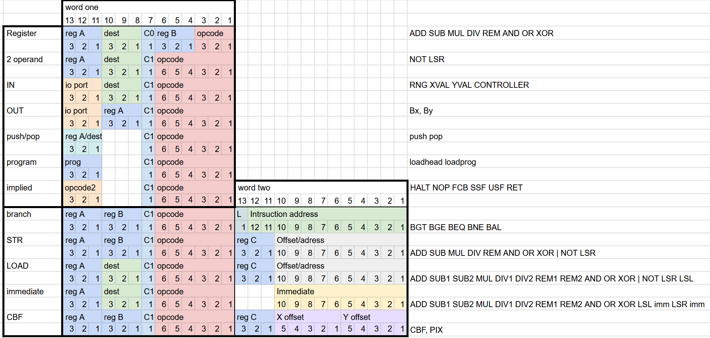
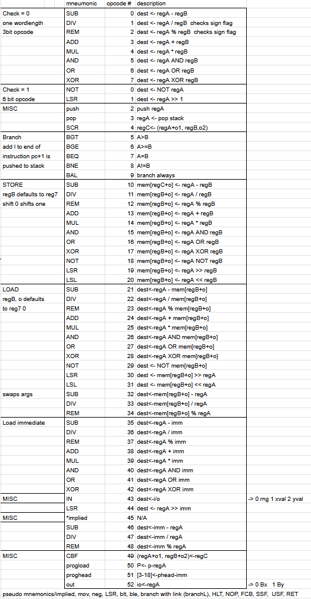
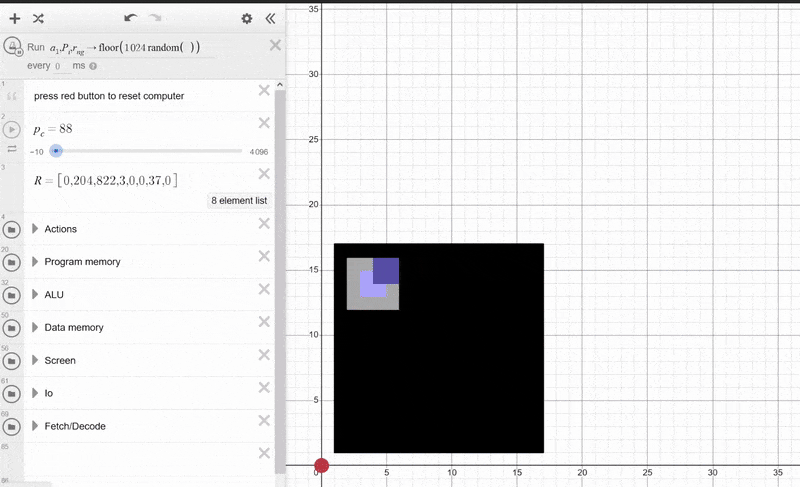

# desmOS
A computer inside Desmos, complete with a custom-built CISC ISA, operating system, assembler, and example programs.


## Hardware
Built around the limitations of the desmos graphing calculator where data can only be readily stored as double precision floats. 
To overcome memory limitations bit-packing is used on the 52 bit mantissa. <br> for efficiency + as a challenge 13 bit instructions are used (52/13 = 4 rem 0)
and a 10 bit word length for data memory (52/10 = 5 rem 2).

### ALU
- add, sub, mul, signed/unsigned div, signed/unsigned rem, and, not, or, xor, lsr, lsl
### Memory
- 8 Registers with r0 being designated as a zero register
- Harvard architecture
- RAM with 1024 addresses
- instruction memory 1024 addresses
- program memory, stores 8 programs
- stack memory
### IO
- OUT: 2 bit 3 channel colour, dynamic height/width
- IN: random number gen, touch screen X,Y


## ISA
ISA overview             |  mneumonics/opcodes/description
-------------------------|---------------
 | 

## OS/Example programs
OS allows for file/memory management and connection with screen input/output. Example programs written in custom assembly language:
- bouncing ball
- minesweeper
- snake
- hello world


## Assembly lang/Assembler
assembler written in python.
### labels
Labels must end with a colon, and be on their own line. A label will always resolve to its absolute address, as all jumps are absolute.
```
start:
mov r1 #10
mov r2 r0
mov r3 #1
loop:
    add r2, r3
    bne r1 r2 loop
```
### const
define constant values:
``` const value #12```

### branch with link
if you add L to the end of a branch instruction, pc+2 is pushed to stack, ret pops from stack and write the value to the pc
```
mov r1 #6
balL square
add r2 #3
hlt

square:
    mul r2 r1 r1
    ret
```

## How to use
Prerequisites:
- pillow library
- numPy library

after creating a program file, and an icon (which will be downsized to 4x4) run the commmand<br>
```python compiler.py programFile.txt -i icon.png -o programOutput.txt```
<br> then copy the contents of programOutput.txt into one of the program slots in the desmos graph.
